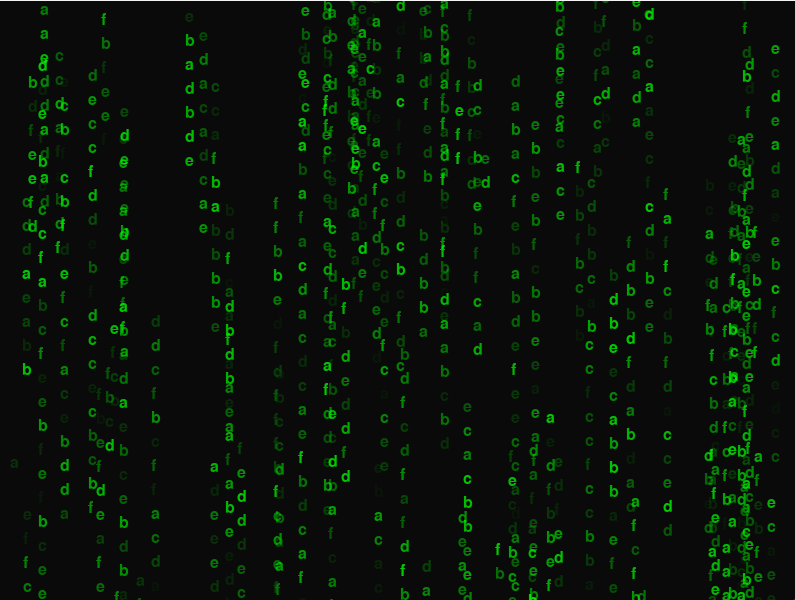

# Film Matrix Character Rain

---

This is a simple program that creates a film matrix effect on the terminal. The program generates a continuous stream of characters that mimic the "falling code" effect seen in movies like "The Matrix". The characters are randomly selected from a set of symbols and appear to be raining down the terminal screen.

### Usage

---

install required libraries and run 

 ```
 pip install -r requirements.txt
 python main.py
 ```

### Screenshots

---



